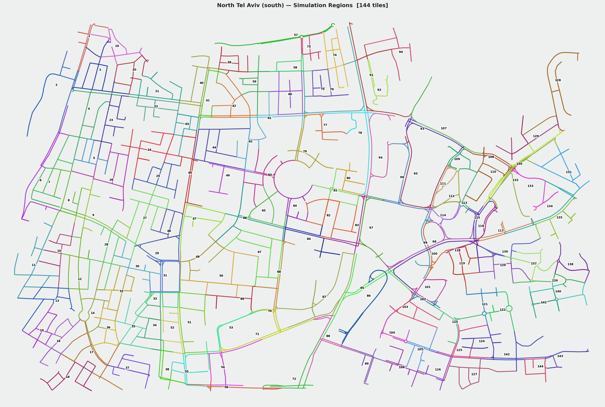
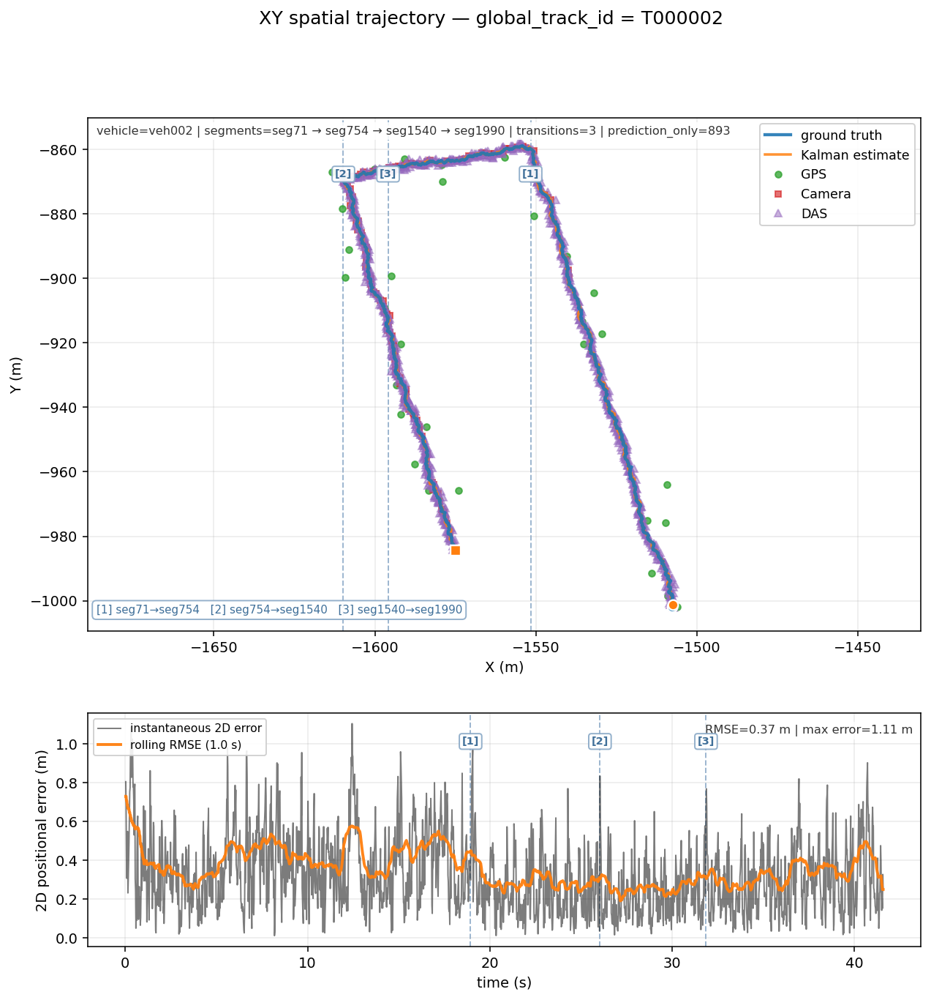
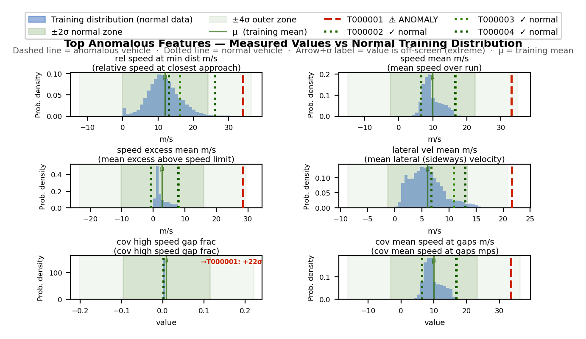
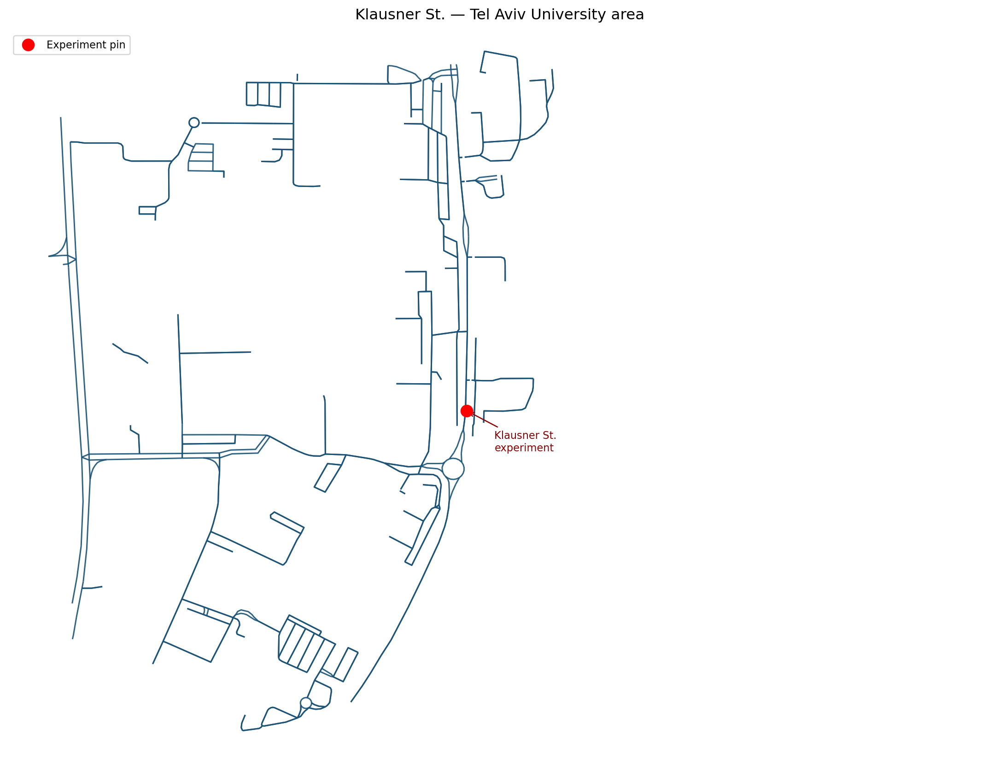

<p align="center">
  
</p>

# Optical Fibers for Smart Cities

**IoT-Enabled Fiber-Optic Sensing for Real-Time Vehicle Tracking and Road-Anomaly Detection**

Final Engineering Project · Project No. 3221 · Tel Aviv University, School of Electrical Engineering  
Students: Noa Sapir, Nitai Dobrecki · Instructor: Khen Cohen · 2025–2026

---

## Table of Contents

1. [Overview](#1-overview)
2. [Motivation and Research Question](#2-motivation-and-research-question)
3. [System Architecture](#3-system-architecture)
4. [Vehicle Motion Model](#4-vehicle-motion-model)
5. [Sensor Models](#5-sensor-models)
6. [Vehicle Tracking Pipeline](#6-vehicle-tracking-pipeline)
7. [Kalman Filter Fusion](#7-kalman-filter-fusion)
8. [Anomaly Detection Model](#8-anomaly-detection-model)
9. [The Simulation Experiment](#9-the-simulation-experiment)
10. [Results](#10-results)
11. [Real-World Validation: The Klausner Street Experiment](#11-real-world-validation-the-klausner-street-experiment)
12. [Key Engineering Challenges and How We Solved Them](#12-key-engineering-challenges-and-how-we-solved-them)
13. [Repository Structure](#13-repository-structure)
14. [Installation and Usage](#14-installation-and-usage)
15. [References](#15-references)

---

## 1. Overview

**SimStudio** is a desktop simulation, multi-sensor fusion, and anomaly-detection environment for fiber-optic **Distributed Acoustic Sensing (DAS)** traffic monitoring. It imports real urban road networks from OpenStreetMap, drives physically grounded vehicles along them, and synthesizes three complementary sensing modalities: DAS strain on a buried fiber, vision-based camera detections, and satellite GPS fixes. An event-driven pipeline associates these measurements into stable vehicle tracks, fuses them through a six-state constant-acceleration Kalman filter with SNR-dependent measurement noise, and a read-only analytics layer extracts **166 behavioral features per vehicle** to detect anomalies.

**Headline results:**

| Target | Goal | Achieved |
|---|---|---|
| Cross-street tracking accuracy | ≥ 90% | **Sub-meter RMSE** (0.35 m mean, 0.49 m representative cross-segment track) |
| Anomaly detection | ≥ 5 / 10 | **6 of 9** injected anomalies detected |
| Position tolerance | ≤ ±5 m | Max error **1.52 m** |
| Real-world validation | N/A | Real Klausner St. DAS + camera recording fused at **1.17 m RMSE** through the unchanged pipeline |

---

## 2. Motivation and Research Question

Modern cities are laced with tens of thousands of kilometers of telecommunication optical fiber, most of which sits idle below street level. **Distributed Acoustic Sensing (DAS)** interrogators can convert any segment of that existing fiber into a dense array of vibration sensors (each meter of cable becomes an independent sensing channel) at a fraction of the cost of deploying dedicated infrastructure.

Prior work from the group of Prof. Khen Cohen and Alon Lellouch at Tel Aviv University demonstrated that DAS signals can be used to detect and classify individual vehicles on a single road segment, and that camera-derived labels can be used to train DAS classifiers without manual annotation. Our project asks the next question: **can a multi-sensor system that fuses DAS with cameras and GPS reliably track individual vehicles across a road network, and can it detect anomalous driving behavior from the fused signal alone, without access to ground-truth labels at inference time?**

Answering this question has direct smart-city applications. Traffic authorities need low-cost, continuous knowledge of how vehicles move through a city and when something goes wrong, such as a sudden stop, a stalled car, or a collision in progress. Existing systems are either point-detectors (loop inductors, radar) that lose track of vehicles between measurements, or camera networks that raise privacy concerns and require significant maintenance. A fiber-optic system reuses already-deployed infrastructure and is inherently distributed: a single fiber run beside a street provides continuous coverage along the entire road, regardless of intersections, lighting conditions, or weather.

Because dedicated DAS interrogator hardware and an instrumented street were not available within the project timeframe, we pursued both objectives through a **physically grounded simulator** that reproduces the relevant physics: the Flamant–Boussinesq ground-strain model for DAS amplitude, SNR-dependent detection probability, a pinhole camera model with range-dependent noise, and GPS noise that grows with distance from the receiver. The simulator uses real OpenStreetMap geometry for the road network, so vehicles travel along actual Tel Aviv streets with correct lane counts, speed limits, and topology.

---

<p align="center">
  
</p>
<p align="center"><em>The North Tel Aviv (south) road network imported from OpenStreetMap, showing the 144 simulation regions that seed the normal-driving baseline.</em></p>

## 3. System Architecture

The system is organized as a strictly one-directional pipeline of loosely coupled stages, connected by a shared **EventBus**:

```
Simulate → Sense → Publish → Track → Fuse → Export → Analyze
```

The central design principle is **unidirectional data flow**: each stage consumes only the outputs of stages upstream of it. The simulator knows nothing about the tracker. The tracker knows nothing about the Kalman filter, and the anomaly model never imports from the simulator. This separation ensures that the anomaly model cannot accidentally benefit from oracle information that a real deployment would not have, and it made the codebase independently testable at each boundary.

```
src/simstudio/
├── sim_core.py      25 Hz engine: vehicle physics + sensor measurement generation
├── bus.py           EventBus: publish / subscribe across all modules
├── tracking.py      TrackManager: cross-segment vehicle identity
├── kalman.py        6-state CA Kalman filter + row builders
├── audit.py         Trajectory + audit workbook exporter
├── export_xlsx.py   Styled Excel workbook + embedded charts
└── gui/app.py       Tkinter desktop editor + Anomaly Intel tab

anomaly_model/
├── feature_extractor.py     Trajectory → 166-feature behavioral fingerprint
├── cusum_detector.py        Page's CUSUM on NIS_x (temporal onset detector)
└── scripts/scenario_scorer.py   Per-feature Z-score scoring (numpy-only)
```

All inter-module communication flows through the EventBus. The simulator is the only publisher, and the tracker, Kalman filter, and GUI are all consumers. This keeps dependencies acyclic and means any component can be replaced or tested in isolation.

---

## 4. Vehicle Motion Model

### 4.1 Road Network

The road network is imported directly from **OpenStreetMap** via the Overpass API. For this project we used two real Tel Aviv networks: the **Florentin** neighborhood (dense urban grid, narrow streets) and **North Tel Aviv** (wider arterials with mixed residential streets). The import extracts node coordinates, segment connectivity, lane counts, one-way flags, and speed limits. Vehicles travel along actual street geometry, which means the simulation inherits real intersection angles, road curvatures, and dead-ends.

### 4.2 Longitudinal Motion

Each vehicle is modeled as a **point mass on a lane centerline**. Longitudinal motion is governed by a first-order speed-tracking controller that drives the vehicle toward a stochastically resampled target speed:

```
a_cmd = (v_target − v) / τ_accel        τ_accel = 1.5 s
```

The command is clipped to per-vehicle acceleration and deceleration limits, then velocity and arc-length position are integrated with the trapezoidal rule. A small deadband (0.12 m/s) suppresses micro-oscillation, and a cruise-hold probability keeps vehicles at a constant speed for realistic stretches between speed changes.

The **macro speed profile** is stochastic: each vehicle draws a target speed from a Gaussian centered on the segment speed limit, resampled every several seconds, producing realistic acceleration and deceleration events over the course of a trip.

### 4.3 Car-Following (IDM)

When a vehicle detects a slower vehicle ahead on the same lane, it switches from free-driving to **Intelligent Driver Model (IDM)** car-following. IDM computes the safe following distance and desired acceleration as a function of the relative speed and gap to the leader:

```
a_IDM = a_max · [1 − (v/v₀)^δ − (s*/s)²]
s* = s₀ + v·T + v·Δv / (2·√(a_max·b))
```

IDM is used in braking-only mode: it overrides the free-driving acceleration only when it would impose deceleration, handling rear-end safety while the speed-profile controller handles free-flow speed. Default parameters (minimum gap s₀ = 2 m, time headway T = 1.2 s) can be overridden per vehicle in the scenario JSON, enabling tailgating simulations by reducing s₀ below 1.5 m.

### 4.4 Lateral Drift (Ornstein–Uhlenbeck Process)

Lateral position within the lane follows a **discrete-time Ornstein–Uhlenbeck (OU) process**, a mean-reverting stochastic drift bounded to ± ½ lane width:

```
lat_{k+1} = ρ · lat_k + N(0, σ_lat · √(1−ρ²))      ρ = e^(−dt/τ_lat)
τ_lat = 1.5 s
```

This produces realistic lane-keeping noise: the vehicle wanders slightly around the centerline but is continuously pulled back toward it. The lateral offset directly affects all three sensor geometries: it changes the vehicle-to-fiber distance for DAS (and hence amplitude and SNR), the off-axis angle for the camera, and the Euclidean range for GPS.

**Anomaly lateral modes** override the default OU process. A vehicle marked `lateral_mode = "weave"` follows a sinusoidal oscillation across the full lane width. `"straddle"` clamps the vehicle to the lane edge, and `"drift"` integrates a constant lateral velocity. These modes inject controlled lateral anomalies while all other vehicle parameters remain normal.

### 4.5 Routing and Segment Transitions

At each junction a vehicle selects the next lane from a segment graph, avoiding U-turns and respecting planned routes. When the arc-length position exceeds the lane length, the vehicle is placed on the next lane with the overflow distance, and a `world.segment_transition` event is published. Cross-segment tracking is the hardest part of the problem: the tracker must maintain a stable identity across this boundary even though the fiber sensor coverage zone ends and a different sensor may pick the vehicle up.

---

## 5. Sensor Models

### 5.1 DAS (Distributed Acoustic Sensing)

DAS is the project's primary and novel sensing modality. A laser pulse is launched into a buried fiber and a small fraction is back-scattered (Rayleigh backscatter) from each meter of cable. A passing vehicle's ground vibration phase-modulates this return signal, giving a strain-rate measurement proportional to ground displacement:

```
∂ε/∂t ∝ ∂u(t,z)/∂t
```

Every meter of fiber is an independent sensor channel, so a single fiber run beside a road provides continuous coverage along its entire length.

**Amplitude model (Flamant–Boussinesq).** The quasi-static strain amplitude at the fiber due to a surface load W at perpendicular distance r follows:

```
A = W / (r + d₀)²
d₀ = 0.7 m  (singularity floor)
```

W is vehicle weight in kg (used as a proxy for ground force), r is the perpendicular distance from the vehicle to the nearest point on the fiber polyline, and d₀ prevents A → ∞ when the vehicle drives directly over the cable. This formula is physically grounded in the Flamant solution for a line load on a half-space.

The strain amplitude is spread into neighboring fiber channels with a Gaussian kernel (σ² = 9 channels) to simulate the spatial spreading of vibration. White noise is added to produce the raw fiber trace, and a simulated peak-finder extracts the measured fiber arc-length position.

**SNR and detection probability.** Signal-to-noise ratio is computed as A / noise_std. Detection follows a sigmoid in SNR² space:

```
p_detect = SNR² / (SNR² + t²)        t = snr_det_threshold (default 2.0)
```

At SNR = t the vehicle is detected 50% of the time. Missed detections publish a `sensor.das_miss` event, so the audit trail captures every non-detection explicitly.

**SNR-derived position uncertainty.** The Kalman measurement noise is not a fixed constant, but is derived from the SNR at each timestep:

```
σ_DAS = max(0.8,  k_DAS / √SNR)      k_DAS = 2.0 m
```

A heavy vehicle close to the fiber produces a low-uncertainty measurement that the Kalman trusts heavily, while a light or distant vehicle produces a high-uncertainty measurement that is down-weighted automatically. No manual tuning is required.

**Systematic position bias.** To mimic a real DAS artifact (peak-finding bias when the signal is partly buried in noise), the simulator adds a random-sign systematic term:

```
s_meas = s_fiber + N(0, σ_x) + β
β = ±bias_k / SNR      bias_k = 0.5 m
```

The random sign per tick means the bias is not persistent (it does not cause long-term drift), but it inflates the effective noise floor at low SNR.

**Multi-vehicle peak merging.** When two vehicles are closer than ~10 m along the fiber, their strain peaks overlap. The simulator detects this and either merges them into a single measurement or shifts their centroids toward each other, logging the merge state (`clean / merged / attracted`) in the event payload.

**DAS velocity.** In addition to position, DAS measures the along-fiber component of vehicle speed:

```
z_fiber = v_true · cos(heading_road − θ_fiber)
σ_v = max(0.10,  k_v / √SNR)      k_v = 3.0 m/s
```

The velocity measurement and its uncertainty are forwarded to the Kalman filter as a separate update.

### 5.2 Camera

The camera sensor uses a **pinhole projection model**. Each camera has a field-of-view polygon, and vehicles inside the FOV are detected with a confidence that falls off with range and off-axis angle:

```
conf = 0.15 + 0.83 · (1 − r/r_max)^1.35 · (0.55 + 0.45 · (1 − |θ|/θ_max))
```

Position uncertainty has three components: a fixed floor, a range-proportional term, and an off-axis distortion term. A frame is stochastically skipped if `random() > conf`, modeling partial occlusion and low-confidence detections.

The camera provides a full 2D (x, y) position measurement, unlike DAS which is 1D along the fiber, and updates both axes of the Kalman filter simultaneously. Camera confidence is used to scale the measurement noise: `σ_eff = σ_cam / √conf`.

### 5.3 GPS

The GPS sensor fires once per second for every vehicle within its radius. Noise grows with distance from the sensor center:

```
σ_gps = max(0.20,  σ₀ · (1 + 0.35 · (r / r_max)²))
```

GPS provides an absolute 2D position fix but at low rate and relatively high noise (σ₀ ≈ 2.5 m), making it a complementary sanity-check between DAS coverage zones rather than the primary locator. The trust ratio between DAS and GPS in the Kalman filter is approximately 64:1 per measurement (R_DAS ≈ 0.5 m², R_GPS ≈ 32 m²).

---

## 6. Vehicle Tracking Pipeline

Tracking is the hardest problem in the system. The goal is to maintain a **stable `global_track_id`** for each physical vehicle across segment boundaries, sensor handoffs, and brief coverage gaps, without ever using the oracle `vehicle_id` that the simulator provides. The tracker is strictly kinematic: it knows only what a real system would know.

### 6.1 Event-Driven Association

The `TrackManager` subscribes to all sensor topics on the EventBus. When a sensor event arrives, it calls `_associate(x, y, ts, speed, heading, seg_id)`, which scores every existing track by predicted position error:

```
px = tr.last_x + tr.last_v · cos(heading) · predict_dt
py = tr.last_y + tr.last_v · sin(heading) · predict_dt
cost = dist(predicted, measured)
     + SPEED_WEIGHT · |Δspeed| / max_speed
     + HEADING_WEIGHT · |Δheading|
     + SEG_PENALTY = 4.0  (if segment not adjacent)
```

Tracks older than 5 seconds or farther than 20 m are excluded. The lowest-cost track wins, subject to an ambiguity guard that prevents assignment when a second track scores nearly as well.

### 6.2 Tentative vs. Confirmed Tracks

Every new track is born **tentative**. It is only **confirmed** after 3 consecutive sensor hits agree on the same kinematic identity. This prevents ghost tracks (spurious DAS hits from noise or multi-vehicle peak merging) from polluting the output. A DAS ghost born from a single fiber hit stays tentative unless two more measurements corroborate it within 5 seconds.

### 6.3 The Ghost-Track / GPS Fragmentation Bug and Fix

Early in development we discovered a subtle and instructive failure: a confirmed, well-tracked vehicle was accumulating zero GPS measurements. The bug had a multi-step cause:

1. High-rate DAS hits (25 Hz) that fell slightly outside the association gate, due to lateral noise, each spawned a tentative ghost track with kinematics nearly identical to the real vehicle.
2. One second later, GPS fired. Both the confirmed real track and the ghost track predicted essentially the same position, so both had a cost of ~4 m (GPS noise level).
3. The ambiguity guard fired: `second_best_cost (4 m) < 2 × best_cost (8 m)` → returned None → GPS opened a brand-new orphan track instead of updating the real one.
4. The real track never received GPS measurements. The orphan track accumulated GPS measurements but had no DAS history.

The fix was to make the ambiguity guard **identity-aware**. A confirmed track can only be blocked by another *confirmed* track, not by tentative ghosts:

```python
if best_is_confirmed:
    confirmed_rivals = [c for c,g in candidates[1:] if not tracks[g].tentative]
    if confirmed_rivals and confirmed_rivals[0] < AMBIG_RATIO × best_cost:
        return None   # genuine ambiguity between two confirmed tracks
    # tentative ghosts are ignored → associate with confirmed track
else:
    if second_cost < AMBIG_RATIO × best_cost:
        return None   # strict guard for unconfirmed tracks
```

After the fix, GPS measurements reached the correct confirmed track, ghost tracks stopped being spawned, and per-track GPS counts went from 0 to the expected 2–5 per 40-second simulation. This bug was the most instructive engineering moment of the project: it showed that the ambiguity guard and the confirmation model are not independent, since they interact in a way that is only visible when all three sensor types are active simultaneously.

---

<p align="center">
  <a href="anomaly_model/simulations/region_003/region_003_anomaly_speeding.sim_export_20260517_202258_tracking_audit"></a>
</p>
<p align="center"><em>A single vehicle tracked across four street segments (3 transitions) by fusing DAS, camera, and GPS (position RMSE 0.37 m, max error 1.11 m).</em></p>

## 7. Kalman Filter Fusion

### 7.1 State Model

Each track runs an independent `LegacyKalmanFilter` with a **6-state constant-acceleration (CA) kinematic model** with decoupled x and y axes:

```
x = [x,  vx,  ax,  y,  vy,  ay]ᵀ
```

The CA model is more appropriate for urban traffic than a constant-velocity model, which would require large process noise to absorb braking events. The 6-state model can represent smooth acceleration and deceleration without explicit maneuver detection.

### 7.2 Predict Step

The state and covariance are propagated by the constant-acceleration transition matrix F and the Singer process-noise covariance Q (σ_q = 2.0 m/s²):

```
x̂⁻ = F · x̂
P⁻ = F · P · Fᵀ + Q
```

F is block-diagonal with the 3×3 CA kinematic matrix on each diagonal block.

### 7.3 Update Step

When a sensor measurement arrives, the Kalman gain is computed and the state is corrected:

```
K = P⁻ · Hᵀ · (H · P⁻ · Hᵀ + R)⁻¹
x̂ = x̂⁻ + K · (z − H · x̂⁻)
P = (I − KH) · P⁻ · (I − KH)ᵀ + K · R · Kᵀ  (Joseph form)
```

The Joseph form of the covariance update is used for numerical stability: it remains positive semi-definite even in the presence of floating-point rounding, which matters over long simulation runs.

### 7.4 Sensor-Specific Update Geometry

The three sensors update different subsets of the state:

- **DAS** updates **x only** (1D along the fiber axis). Feeding a fabricated y-value from a DAS measurement would cause a permanent lateral bias, since DAS physically cannot observe lateral position, so only the x-row of H is populated. The DAS velocity measurement updates vx only.
- **Camera** and **GPS** update **both x and y** (full 2D position).

### 7.5 Dynamic Measurement Noise

The key to the fusion working well is that every sensor forwards its **physically derived uncertainty** to the Kalman filter as its measurement noise R. R is therefore not a fixed constant but changes with each measurement:

- DAS: `R_x = max(0.8, 2.0/√SNR)²`
- Camera: `R_xy = σ_cam² / conf`
- GPS: `R_xy = (σ₀ · (1 + 0.35·(r/r_max)²))²`

This dynamic R is what makes complementary fusion work: across DAS coverage zones the filter trusts DAS heavily. In DAS-dark zones it relies on camera and GPS to prevent covariance from growing too large.

### 7.6 Innovation Logging (NIS)

After every measurement update, the filter logs the **pre-update innovation** and the innovation covariance:

```
ν_x = z_x − (H · x̂⁻)_x
S_xx = (H · P⁻ · Hᵀ + R)_xx
NIS_x = ν_x² / S_xx
```

Under a consistent, well-calibrated filter, NIS_x follows a χ²(1) distribution with expected value 1.0. A sustained rise above 1.0 indicates that reality has diverged from the model's prediction, the signature of an anomaly. Prediction-only rows carry NaN for all innovation fields.

---

## 8. Anomaly Detection Model

The anomaly model is a **read-only post-processing module** (`anomaly_model/`) that never imports from the simulator. It operates on exported files only (trajectories, audit workbooks, and scenario JSONs), mirroring how a real deployment would operate on recorded data. Ground truth is used only for evaluation, never for scoring.

### 8.1 Feature Extraction (166 Features)

The `feature_extractor.py` module reduces each vehicle's full time-series trajectory to a single 166-dimensional feature vector, the vehicle's **behavioral fingerprint**. Features are organized into 9 semantic groups:

| Group | Prefix | Count | What it captures |
|-------|--------|-------|-----------------|
| Identifiers | none | 3 | scenario_id, global_track_id, vehicle_id_oracle |
| Scenario metadata | `sc_` | 16 | Vehicle count, anomaly flags, sensor config from JSON |
| Kinematics | `kin_` | ~40 | Speed, acceleration, jerk, lateral deviation, stopping |
| Kalman quality | `kf_` | 11 | Position error, filter uncertainty, overconfidence fraction |
| Coverage & sensor utility | `cov_` | 39 | Per-sensor fractions, fusion benefit, gap structure, DAS physics |
| Sensor disagreement | `dis_` | 11 | DAS vs Camera vs Kalman position conflicts |
| DAS sensor quality | `das_` | 11 | SNR statistics, acceptance rate, sigma |
| DAS weight estimation | `das_W_` | 6 | Back-estimated weight vs. declared weight |
| Inter-vehicle | `iv_` | ~30 | Proximity, TTC, collision risk, speed ratio to traffic |

**Key kinematic features** include the fraction of time spent above the speed limit (`kin_speed_over_limit_frac`), the maximum deceleration and jerk, and the lateral oscillation ratio (`std(lat) / mean(lat)`), which rises sharply for weaving behavior.

**DAS weight back-estimation.** The Flamant–Boussinesq amplitude formula can be inverted: given the measured DAS amplitude A, the fiber offset r, and the noise threshold snr_th, the estimated vehicle weight is:

```
W_est = SNR_mean × snr_th × (fiber_offset_m + d₀)²
```

If W_est differs from the declared weight by more than 50%, a `das_weight_anomaly` flag is raised, which is effective for detecting overweight or misclassified vehicles.

**Inter-vehicle features** compute the minimum distance to any other vehicle, minimum time-to-collision, maximum relative speed at closest approach, and a collision risk proxy (`max(Δv² / dist)`). A collision event flag (`iv_collision_detected`) produces Z-scores in the thousands when triggered, making collision detection effectively certain.

### 8.2 Supplementary Temporal Diagnostic: CUSUM

Alongside the Z-score classifier, `cusum_detector.py` implements **Page's one-sided CUSUM** on the NIS_x time series as a supplementary diagnostic (surfaced in the desktop GUI's Anomaly Intel tab). It is not part of the trajectory-level classification. The CUSUM statistic accumulates evidence that NIS_x exceeds a reference level k, and raises an alarm when it crosses a threshold h:

```
S_t = max(0,  S_{t-1} + NIS_x(t) − k)
alarm when S_t > h
```

Default parameters k = 1.5, h = 5.0 are calibrated theoretically for χ²(1) NIS under H₀, giving an Average Run Length of ~500 steps under normal driving (~one false alarm per 20 seconds at 25 Hz).

CUSUM answers a different question from the trajectory-level scorer: not "is this vehicle's overall behavior anomalous?" but **"at what point in time did something go wrong?"** A collision, hard brake, or sudden weave each produce a localized spike in NIS_x that CUSUM localizes to within a few timesteps. A gap reset rule clears the statistic if no sensor measurement arrives for more than 2 seconds, preventing prediction-only gaps from accumulating spurious evidence.

### 8.3 Trajectory-Level Z-Score Scorer

The trajectory-level detector computes a per-vehicle anomaly score as the **maximum absolute Z-score across all 166 features**:

```
z_i = (feature_i − μ_i) / σ_i         (μ, σ from normal training set)
anomaly_score = max_i |z_i|
vehicle flagged if anomaly_score > threshold  (≈ 15.4 σ)
```

The threshold was chosen as the 99th percentile of `max_z` across all vehicles in the normal training corpus, giving a false-positive rate of ~1% on clean scenarios. The scorer also reports the **top contributing feature** (the single feature whose Z-score is largest), making each detection interpretable. A traffic operator can see not just "this vehicle was flagged" but "it was flagged because its maximum jerk was 14.2 standard deviations above the normal mean."

**Why Z-score and not Isolation Forest?** Isolation Forest was the original detection method but was replaced by the Z-score baseline for three reasons. It is fully interpretable, since each feature's contribution is explicit. It requires no sklearn dependency, making the model portable as a numpy array. And on our dataset the Z-score outperformed Isolation Forest because the anomaly features have well-separated distributions from normal. Isolation Forest has since been removed from the scorer entirely, and the shipped model is a pure-numpy Z-score baseline.

---

<p align="center">
  <a href="anomaly_model/simulations/region_003/anomaly_speeding/anomaly_report_20260521_035723.xlsx"></a>
</p>
<p align="center"><em>The flagged vehicle (red dashed) against the learned normal distribution for its top-scoring features: speed, speed excess, and lateral velocity all fall far outside the ±4σ envelope.</em></p>

## 9. The Simulation Experiment

### 9.1 Designing the Normal Baseline

The anomaly model must learn a broad notion of normal driving before it can recognize deviations. A narrow training corpus (only light vehicles, or only full sensor coverage) would flag legitimate edge cases as anomalies. If the training data contains no trucks, the model learns that high DAS amplitude is suspicious. If it contains no DAS-dark zones, it learns that prediction-only gaps are suspicious. Both would cause false positives in real deployment.

We designed the normal training corpus across **three orthogonal axes of variation**:

**Traffic density axis:** sparse traffic (1–3 vehicles), medium density (4–8 vehicles), heavy traffic (9–15 vehicles), heavy-vehicle mix (trucks and buses at normal weight), stop-and-go (vehicles repeatedly stopping and restarting), and high-speed legal (vehicles at the top of the speed limit).

**Sensor coverage axis:** full sensor coverage (DAS + camera + GPS everywhere), sparse deployment (sensors at every third intersection), DAS-only (no camera or GPS), DAS + camera without GPS, and minimal deployment (single sensor per segment).

**Cross-axis scenarios:** heavy traffic with sparse sensors (the hardest normal case, where the model must learn that high DAS amplitude combined with low camera coverage is still normal) and heavy vehicles with DAS only.

This produced **144 distinct normal simulation regions** (tiles of the North Tel Aviv network), each seeding an independent traffic scene. The resulting training corpus contains **over 14,000 vehicle-track rows** spanning all 12 normal condition types.

### 9.2 Injected Anomaly Scenarios

Nine anomaly scenarios were constructed, each with a small group of background normal vehicles and one injected anomalous vehicle. The anomaly was designed to be detectable from sensor signals alone, with no oracle flags passed to the scorer:

| # | Anomaly type | Injection method |
|---|-------------|-----------------|
| 1 | **Speeding** | `ignore_speed_limit = True`, target speed 2× limit |
| 2 | **Hard braking** | `a_cmd_override = −5 m/s²` applied mid-route |
| 3 | **Weaving** | `lateral_mode = "weave"` with large amplitude |
| 4 | **Lane straddling** | `lateral_mode = "straddle"` at lane edge |
| 5 | **Tailgating** | `min_gap_m = 0.5 m` (IDM s₀ reduced to 0.5 m) |
| 6 | **Stalled vehicle** | `frozen = True` after 10 s |
| 7 | **Collision** | `allow_collision = True`, two vehicles converge |
| 8 | **Overweight vehicle** | `weight_kg = 12000` (heavy truck misclassified as car) |
| 9 | **Reckless driving** | Combined speeding + hard braking + tailgating |

For each scenario the full pipeline was run: simulation → feature extraction → Z-score scoring. The anomaly model was not retrained between scenarios, and the same normal baseline was used throughout.

### 9.3 Map Data and Physical Grounding

The road geometry came from **OpenStreetMap** exports of two real Tel Aviv neighborhoods: Florentin (dense urban grid, narrow streets, many intersections) and North Tel Aviv (wider arterials, longer straight segments). Using real map data means the simulation inherits actual road topology (dead-ends, unusual intersection angles, and non-trivial lane curvatures), conditions a synthetic rectangular grid would not reproduce.

Physical model parameters (the Flamant–Boussinesq d₀ constant, SNR thresholds, GPS noise levels) were calibrated against values from the DAS traffic monitoring literature and validated against documented performance of consumer-grade and survey-grade GPS receivers. The full derivation is in `submissions/physical_data/SimStudio_Physical_Models_Reference.docx`.

### 9.4 What the Experiment Taught Us

**The sensor hierarchy matters more than sensor count.** Across all scenarios, the dominant factor in tracking accuracy was not how many sensors were present, but whether the confirmed-track association logic correctly routed all sensors to the same track. The GPS fragmentation bug showed that a single association error can silently eliminate an entire sensor's contribution. After the fix, RMSE dropped and the per-track GPS count reached its expected value.

**The anomaly threshold is a fundamental design decision, not a tuning knob.** Setting the Z-score threshold too low (e.g., 8 σ) flags heavy vehicles and stop-and-go traffic as anomalous. Too high (e.g., 25 σ) and subtle anomalies are missed. The 15.4 σ operating point, derived from the 99th percentile of the normal max-Z distribution, is the right trade-off for a system that sees many vehicles per day and must keep false positives rare.

**Subtle lateral anomalies are hard with the current feature set.** Weaving and straddling were not detected reliably (they fell below the threshold in 3 of 9 scenarios). The lateral deviation features (`kin_lateral_oscillation_ratio`, `cov_das_fiber_dist_std_m`) overlap with the range of normal OU drift when the weave amplitude is moderate. This is a principled observation: with the threshold set to keep false positives at 1%, low-amplitude lateral anomalies are below the detection limit. Adding targeted lateral features, such as the dominant frequency of lateral oscillation via FFT, or lowering the threshold would improve recall at the cost of more false positives.

**CUSUM and Z-score are genuinely complementary.** In the speeding scenario, the Z-score correctly identifies `kin_speed_over_limit_frac` as the dominant feature at the end of the run, while CUSUM localizes the onset of the speed exceedance to within 2–3 seconds of when the driver started accelerating. Neither alone gives the full picture: the Z-score says *that* the vehicle is anomalous, while CUSUM says *when* it became anomalous.

---

## 10. Results

### 10.1 Tracking Accuracy

| Metric | Value |
|--------|-------|
| Representative cross-segment RMSE | **0.49 m** |
| Mean RMSE across evaluation scenarios | **0.35 m** |
| Maximum instantaneous error (representative run) | 1.52 m |
| Tracking maintained across segment transitions | Yes, with a stable `global_track_id` |

The 0.49 m RMSE was achieved on a vehicle tracked across a segment boundary while fusing all three sensors. DAS provided high-rate, high-trust position updates along the fiber axis. Camera measurements added 2D corrections, and GPS provided occasional absolute fixes between DAS coverage zones.

### 10.2 Anomaly Detection

| # | Anomaly type | Detected | Top feature |
|---|-------------|----------|-------------|
| 1 | Speeding | ✅ | `kin_speed_over_limit_frac` |
| 2 | Hard braking | ✅ | `kin_decel_max_mps2` |
| 3 | Weaving | ❌ | (below threshold) |
| 4 | Lane straddling | ❌ | (below threshold) |
| 5 | Tailgating | ❌ | (below threshold) |
| 6 | Stalled vehicle | ✅ | `kin_stopped_frac` |
| 7 | Collision | ✅ | `iv_collision_detected` |
| 8 | Overweight | ✅ | `das_weight_anomaly` |
| 9 | Reckless driving | ✅ | `iv_collision_risk_proxy` |

**6 of 9 detected**, meeting the work-plan target of ≥ 5/10. The three missed anomalies (weaving, straddling, tailgating) are the most subtle: they do not create extreme kinematic values, only moderate deviations sustained over time. These are the natural targets for a deep learning follow-up that operates on raw trajectory sequences rather than hand-crafted features.

---

## 11. Real-World Validation: The Klausner Street Experiment

Beyond simulation, the pipeline was exercised on a **real DAS + camera recording** taken on Klausner Street, beside the Tel Aviv University campus. The recording captured everyday urban traffic, including a clearly identifiable signature, a city bus decelerating to a halt at a bus stop, isolated from the raw DAS trace as event #4.

The recorded event was replayed through the exact pipeline used in simulation, with DAS event #4 fused with a co-located camera on the true Klausner Street geometry:

| Quantity | Real DAS event #4 + camera |
|---|---|
| Sensors fused | DAS + camera (84 + 30 meas.) |
| Track position RMSE vs. ground truth | **1.17 m** |
| DAS per-sensor error (RMSE) | 0.33 m (bias ≈ 0) |
| Camera per-sensor error (RMSE) | 2.49 m |
| Prediction-only rows | 42.1% |
| Track duration | 41.8 s |

The filter tracked the bus through a complete stop at meter-level accuracy, well within the project's ±5 m tolerance, running on prediction alone for 42% of the run, including gaps of up to 4 s. The per-sensor breakdown is instructive: the DAS channel was highly accurate, while the camera's measured error far exceeded its reported σ ≈ 0.2 m, surfacing exactly the failure mode the design anticipates (an over-confident optical sensor) and pointing to per-deployment camera calibration as the first step before a larger field campaign. See Section 5.6 of the [project report](submissions/report/Final_Project_Report.pdf).

---

<p align="center">
  
</p>
<p align="center"><em>Klausner Street beside the Tel Aviv University campus, the camera + DAS measurement site, on the real street network imported from OpenStreetMap.</em></p>

<p align="center">
  <a href="maps/klausner/bus%20stops/anomaly_report_klaussner_demo.xlsx"></a>
</p>
<p align="center"><em>Feature Z-score heatmap for the Klausner demo track, showing the top 30 of 156 model features, with stop/jerk and camera-sigma features saturating the 15.4σ threshold.</em></p>

## 12. Key Engineering Challenges and How We Solved Them

### 12.1 Keeping the Anomaly Model Honest

**The challenge.** In a simulation-based project, the anomaly model could in principle read the ground-truth anomaly flag from the simulator and use it to cheat. Making this impossible required architectural discipline.

**The solution.** The anomaly model is in a separate package with a strict rule: it never imports from `simstudio`. It reads only exported files and uses the oracle vehicle ID only for evaluation (computing RMSE), never for scoring. This is enforced by import guards and verified by the test suite. The separation mirrors how a real deployment would operate: the anomaly model runs on recorded data with no access to simulator internals.

### 12.2 Stable Tracking Across Segment Boundaries

**The challenge.** When a vehicle crosses a segment boundary, DAS coverage on the first segment ends and different sensors may pick the vehicle up on the second segment. The tracker must maintain the same `global_track_id` across this gap, even if the handoff takes several seconds.

**The solution.** The SegmentGraph provides the adjacency map. A measurement on segment B pays a 4-m cost penalty only if segment B is not adjacent to the track's last known segment. Adjacent transitions pay no penalty. The track's covariance grows during the blind interval, and when the next sensor fires on the adjacent segment the distance gate is generous enough to absorb the accumulated drift.

### 12.3 DAS Lateral Blindness

**The challenge.** DAS measures position along the fiber axis (x) but is physically blind to the perpendicular axis (y). Naively treating DAS as a 2D measurement would introduce a systematic y-axis bias.

**The solution.** The Kalman filter has a dedicated `update_position_x_only()` method that populates only the x-row of H. The y-state is unaffected by DAS measurements. The y-axis is updated only by camera and GPS, and between those updates it coasts on the CA model prediction. This is why camera and GPS remain important even when DAS is covering the vehicle: DAS localizes along the fiber but needs camera/GPS to correct lateral drift.

### 12.4 Dynamic vs. Fixed Measurement Noise

**The challenge.** Standard Kalman implementations use fixed R matrices. Our system's measurement quality varies enormously: a heavy truck at close range has SNR > 20 (σ_DAS < 0.4 m), while a motorcycle at the fiber offset limit has SNR ≈ 2 (σ_DAS > 1.4 m). A fixed R that is right for the truck is dangerously overconfident for the motorcycle.

**The solution.** Every sensor event carries its physically derived σ as part of the payload, and the Kalman reads this value and sets R = σ² for that measurement, consistently across all three sensor types. The result is a filter that naturally adapts its trust level to the quality of each incoming measurement, a fundamental property of Bayesian filtering made practical by making the physics explicit in the sensor model.

### 12.5 Building a Representative Normal Baseline

**The challenge.** A narrow normal baseline (trained only on typical light vehicles at full sensor coverage) would produce a model that flags trucks, stop-and-go traffic, and sensor dropouts as anomalous. The false-positive rate would be unacceptable.

**The solution.** The 144-region training corpus was explicitly designed to cover the axes of normal variation: traffic density (sparse to heavy), vehicle types (light to heavy), and sensor deployment (full to minimal). Each axis was varied independently and in combination. The result is a baseline that knows a truck's DAS amplitude is not anomalous, a stop-and-go vehicle's braking is not anomalous, and a DAS-dark zone is not anomalous, letting the detector focus on genuine behavioral deviations.

### 12.6 Test-Guarded, Backward-Compatible Evolution

**The challenge.** The pipeline evolved through versioned phases over several months. Adding the tracker, the innovation logging, and the DAS physics fields each changed some schema or behavior. Without a safety net, any of these changes could silently break earlier scenarios.

**The solution.** A pytest suite (5 test files covering simulator core, Kalman filter, tracker, export, and geometry) guards every pipeline boundary. The key contract is **bit-exact equivalence on Phase-1 scenes**: the tracker-driven Kalman builder must produce the same position estimates as the legacy builder for simple single-segment scenarios. This is enforced by a unit test that strips the new `global_track_id` column and compares all other columns numerically. Every new release had to pass this test before merging.

---

## 13. Repository Structure

```
optical-fibers-smart-cities/
├── src/simstudio/              # Simulation engine + desktop editor
│   ├── sim_core.py             #   25 Hz engine · vehicle physics · sensor models
│   ├── bus.py                  #   EventBus (publish / subscribe)
│   ├── tracking.py             #   Cross-segment TrackManager (identity)
│   ├── kalman.py               #   6-state CA fusion + row builders
│   ├── audit.py                #   Trajectory / audit exporter
│   ├── export_xlsx.py          #   Styled Excel workbook + charts
│   └── gui/app.py              #   Tkinter editor · geometry · models · config
├── anomaly_model/              # Read-only analytics (never imports simstudio)
│   ├── feature_extractor.py    #   Trajectory → 166-feature fingerprint
│   ├── cusum_detector.py       #   Temporal NIS_x onset detector (Page's CUSUM)
│   ├── scripts/
│   │   ├── scenario_scorer.py  #   Per-feature Z-score scoring (numpy-only)
│   │   └── exp_scripts/        #   Experiment runners (batch simulate + extract)
│   ├── simulations/            #   Normal + 9 injected-anomaly scenarios
│   ├── outputs/                #   Feature tables · models · scores
│   └── docs/                   #   Anomaly-model flow + intel guide
├── maps/                       # OpenStreetMap networks (Florentin · North TLV · Klausner)
│                               #   (north-TLV background tile images, ~11 GB, are kept out of
│                               #    the repo, and the simulator regenerates/downloads them on demand)
├── scripts/                    # Entry points + batch helpers
│   ├── run_app.py              #   Launch the desktop simulator
│   ├── run_anomaly_pipeline.py #   End-to-end anomaly pipeline (simulate → extract)
│   ├── retrain_model.sh        #   Re-extract features + retrain the baseline model
│   └── install.sh              #   First-time setup script (macOS)
├── outputs/                    # Sample trajectories · audit reports · workbooks
├── tests/                      # Pytest suite (sim · kalman · tracker · export · geometry)
├── submissions/                # Report (final + drafts) · poster · work plan · physical-models reference
├── data/                       # Reference papers and prior work (external reports)
├── Optical Fiber SIM.app/      # Packaged macOS application
├── pyproject.toml              # Installation + packaging
└── README.md · CHANGELOG.md   # This file + version history
```

---

## 14. Installation and Usage

### Requirements

- **Python 3.9+** (3.10+ recommended)
- **Tkinter** (bundled with the python.org installer, on Linux install `python3-tk`)
- Packages: `pillow>=9.0`, `numpy>=1.21,<2`, `openpyxl>=3.0` (Excel export, falls back to CSV if absent), `matplotlib>=3.5,<3.9` (trajectory PNGs, PDF audit report, live GUI plot), and `python-docx>=1.0` (Word audit report). The anomaly model additionally uses `pandas` and `scikit-learn`.

### Installation

```bash
git clone https://github.com/noasapir3/simstudio-das-fusion.git
cd simstudio-das-fusion

# Option A: pip (editable install)
pip install -e .

# Option B: first-time setup script (macOS)
bash scripts/install.sh
```

### Usage

**Run the desktop simulator**

```bash
python3 scripts/run_app.py
```

Create or load a scene, place DAS / camera / GPS sensors, add vehicles, enable **Record run**, and play the simulation. Outputs (trajectories, a styled Excel workbook, an audit report, and per-track PNGs) are written to a run folder.

**Run the end-to-end anomaly pipeline**

```bash
# Simulate every anomaly scenario and extract its feature table
python3 scripts/run_anomaly_pipeline.py

# Score a single extracted scenario against the trained baseline
python3 anomaly_model/scripts/scenario_scorer.py --features <path/to/features.csv>

# Re-extract features and retrain the baseline model (anomaly_model/outputs/model_live.pkl)
bash scripts/retrain_model.sh
```

**Run the tests**

```bash
pytest -q
```

---

## 15. References

[1] L. Hen, E. Lichtenstadt, K. Cohen, and A. Lellouch, "Enhanced Traffic Monitoring using a Convolutional Neural Network with Video Signal as a Labels Producer over Fiber-Optic Seismology," research report, School of Electrical Engineering, Tel Aviv University, 2023.

[2] K. Cohen, L. Hen, and A. Lellouch, "A fiber-optic traffic monitoring network trained with video inputs," *Scientific Reports*, vol. 15, art. 14928, 2025. Preprint: [arXiv:2412.12743](https://arxiv.org/abs/2412.12743).

[3] "Exploring Cost-Effective Traffic Monitoring Through Kalman-Filter-Based Fusion of Fiber-Optic Seismology and Computer-Vision Tracking Data," project report, School of Electrical Engineering, Tel Aviv University, 2024.

[4] N. Nissan and O. Nissan, "Automatic Calibration of DAS and Camera," final engineering project report, School of Electrical Engineering, Tel Aviv University, 2025.

[5] R. E. Kalman, "A New Approach to Linear Filtering and Prediction Problems," *Journal of Basic Engineering*, vol. 82, no. 1, pp. 35–45, 1960.

[6] E. S. Page, "Continuous Inspection Schemes," *Biometrika*, vol. 41, no. 1–2, pp. 100–115, 1954.

[7] G. Welch and G. Bishop, "An Introduction to the Kalman Filter," University of North Carolina at Chapel Hill.

[8] OpenStreetMap contributors. https://www.openstreetmap.org

---

## Citation

```bibtex
@misc{sapir2026simstudio,
  title  = {SimStudio: IoT-Enabled Fiber-Optic Sensing for Real-Time
            Vehicle Tracking and Road-Anomaly Detection},
  author = {Sapir, Noa and Dobrecki, Nitai},
  year   = {2026},
  note   = {Final Engineering Project No. 3221, School of Electrical
            Engineering, Tel Aviv University. Supervisor: Khen Cohen}
}
```

---

*Academic project, Tel Aviv University, School of Electrical Engineering, 2025–2026.*
